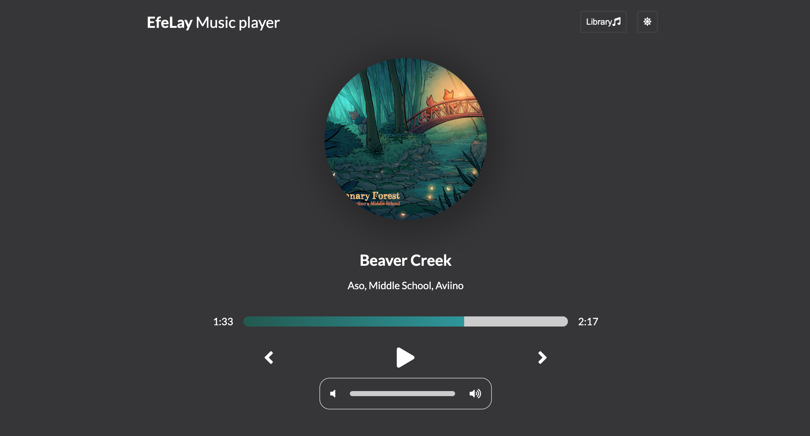
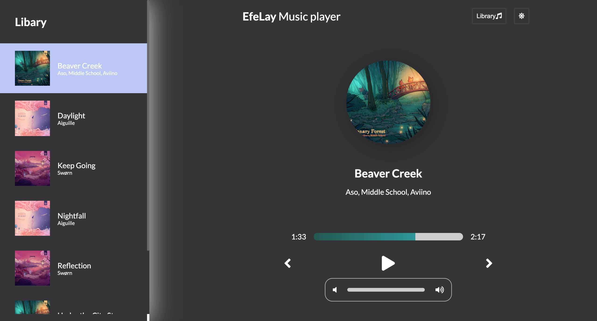

<h1 align="center">
 EfeLay Music player
</h1>

# Efelay Music Player

Efelay Music Player is an application created with ReactJS where you can play music choose from the library.

## Table of contents:

- **[App demo](#app-demo)**
- **[Goals for this project](#goals-for-this-project)**
- **[Technologies used](#technologies-used)**
- **[User stories](#user-stories)**
- **[Instalation](#instalation)**
- **[Screenshots](#screenshots)**

### App Demo:

#### Link to the app [Efelay Music Player](https://efelay-music-player.netlify.app/).

### Goals for this project

The goal of this project is to build a React app and style it whit SCSS(Sass).

### Technologies used:

### User Stories

- As a user, I want to play music
- As a user, I want to choose the music from the library
- As a user, I want to choose a theme in night or day mode

### Instalation

1. Clone the app
2. cd into your project
3. install dependencies (npm install)
4. Start development server with (npm start)

### Screenshots

